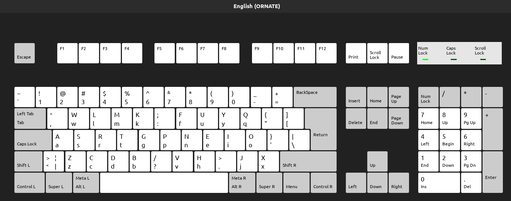

# Install

1. open bash shell (or zsh or fish)
```
$ git clone https://github.com/sazk07/ORNATE-Optimized-Keyboard-Layout-Project.git 
```
(install git beforehand if you have to)

2. make backups of existing `/usr/share/X11/xkb/rules/evdev.lst` and `/usr/share/X11/xkb/rules/evdev.xml`
```
$ cp /usr/share/X11/xkb/rules/evdev.* ~/` 
```

3. copy `evdev.xml` and `evdev.lst` to `/usr/share/X11/xkb/rules`

```    
$ sudo cp evdev.* /usr/share/X11/xkb/rules 
```

4. go to your `ORNATE-Optimized-Keyboard-Layout-Project` directory

5. copy `us` file over to `/usr/share/X11/xkb/symbols`
```
$ sudo cp us /usr/share/X11/xkb/symbols
```
6. go to Settings > Keyboard > Input Sources > English (US) > ORNATE . Layout will appear on next login (you can do the same for any of ORNATE's mods i.e. ORNATE for programming, ORNATE wide mod, ORNATE for programming WIDE mod)

### ALTERNATIVELY

copy `or`,`orp`,`orpw`,`orw` over to `/usr/share/X11/xkb/symbols` and `setxbkmap or` OR orp OR orpw OR orw
```
$ sudo cp or* /usr/share/X11/xkb/symbols && setxkbmap or
```

## ORNATE keyboard map



## ORNATE wide mod


## ORNATE for programming


## ORNATE for programming WIDE mod

