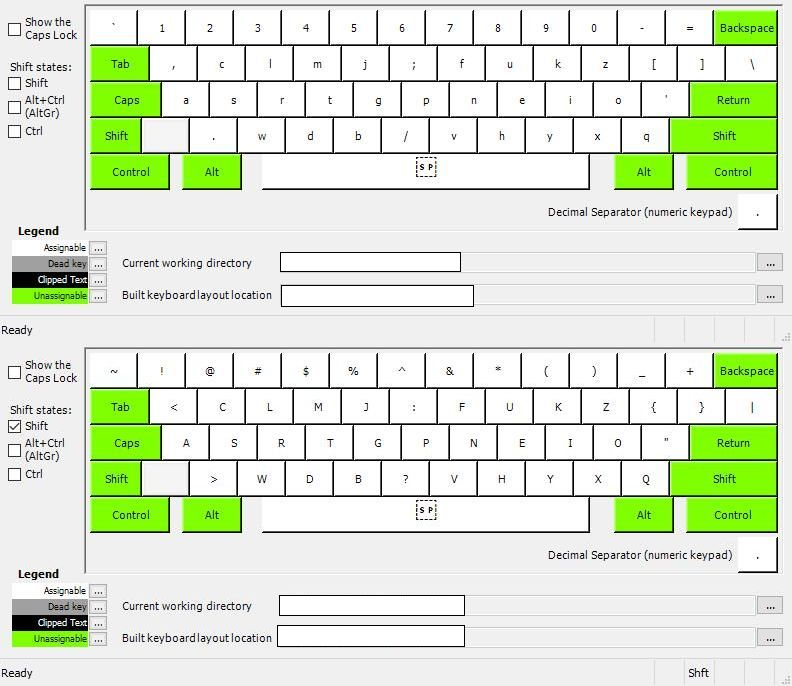

# Rukia-Optimized-Keyboard-Layout-Project
An optimized keyboard layout for easier and faster typing.

The conventional QWERTY keyboard is not optimized for modern day typing because it was designed in 1873 to prevent typewriter keys from jamming, not for easier or faster typing. Under QWERTY the most frequently used keys were placed apart from each other to prevent them from jamming; This results in a non-ergonomic layout. The problem is, we don't use typewriters anymore so the question of keys jamming is reduntant. Keyboards are still using this inefficient pattern. However, there are alternatives.

This is a variation of the Colemak designed keyboard. It uses Colemak's own metrics to score a lower Finger Bigram frequency and lower Total Finger Effort score than Colemak itself. It is 84% more efficient than QWERTY.

# How to install
* Go to the green button "Code" and download ZIP the rukia folder
* Unzip and just run setup.exe. 
* for programming or just for reversing the numbers and symbols: download the rukia for programming folder and run setup.exe. 
* Restart the computer and press Win + Spacebar to change the layout in Windows. 
* An image of the keyboard layout is in the folder for touch typing reference. 

All files created using Microsoft Keyboard Layout Creator.

## Resources for Touch Typing Training
* [Keybr](https://www.keybr.com/)
* [Monkeytype](https://monkeytype.com/)
* [Typeracer](https://play.typeracer.com/)

## Features

* 50-50 balanced workload between the left and right hand
* High typing efficiency
* Very low overall finger travel 
* Very low same finger bigrams allowing for faster typing
* Common English bigrams are easy to type
* Comfortable, ergonomic, and efficient — frequent keys are placed within the natural range of motion of the fingers
* ZXCV shortcuts are masked in their old positions, meaning that pressing the Ctrl key will use ZXCV shortcuts in their old positions.

## Keyboard Layout Analyzer Scores (AKA How RUKIA is better)
### Using [Colemak Mod-DH analyzer](https://colemakmods.github.io/mod-dh/analyze.html) ###

| Overall Finger Distance Travel (using text of "1984" by George Orwell)| (in metres)  |
| --- | --- |
| RUKIA | 594.0 |
| Colemak | 653.0 |
| Workman | 610.6 |
| Dvorak | 659.6 |
| QWERTY | 1125.8 |

| Finger Frequency |   | 
| --- | --- |
| left pinky: 	9.62%  	 | right pinky: 	8.91% |
| left ring: 	8.33%  	   | right ring: 	8.81% |
| left middle: 	11.69%   | right middle: 	15.76% |
| left index: 	19.69%   | right index: 	17.19% |
| **total L 	49.33%** (vs QWERTY: 55.02%) 	   | **total R 	50.67%** (vs QWERTY: 44.98%) |

| Finger Bigram Frequency (lower is better) |   |
| --- | ---| 
| left pinky: 	0.022%	| right pinky: 	0.084% |
| left ring: 	0.079%	| right ring: 	0.045% |
| left middle: 	0.417%	| right middle: 	0.381% |
| left index: 	0.225%	| right index: 	0.162% |
| **RUKIA total:**  | 	**1.415%** |
| Other layouts: | |
| QWERTY: | 6.575%  |
| Dvorak: | 2.625% |
| Workman: | 3.147% |
| Colemak: | 1.669% |
| Colemak-DH: | 1.644%  |

| Finger Effort (lower is better) |   |   |   |   |
| --- | --- | --- | --- | ---|
| 	| base	| same finger bigrams | neighbour finger bigrams |	total |
| left pinky | 0.18444 |	0.00055 |	0.01784	| 0.20283 |
| left ring |	0.12866 |	0.00198 |	0.00101	| 0.13165 |
| left middle | 0.19038 |	0.01162	| 0.00000 |	0.20200 |
| left index | 0.34115 |	0.00658 |	0.00000	| 0.34773 |
| right index |	0.28565	| 0.00412 |	0.00000 |	0.28977 |
| right middle | 	0.20320 |	0.00967 |	0.00000 |	0.21287 |
| right ring |	0.13351	| 0.00113	| 0.00192 |	0.13656 |
| right pinky | 0.16990 |	0.00239 |	0.00997 |	0.18227 |
| **total** | 	**1.63689**	| **0.03803**	| **0.03075**	| **1.70566** |
| Other layouts: |||||
| QWERTY | 2.24566 |0.18467 |0.03006|2.46039|
| Dvorak | 1.85069 |0.06683|0.01323|1.93075|
| Workman | 1.68059 |0.08280|0.02812|1.79151|
| Colemak | 1.73279 |0.04722|0.02939|1.80939|
| Colemak-DH | 1.64170 |0.04330|0.02983|1.71482|
