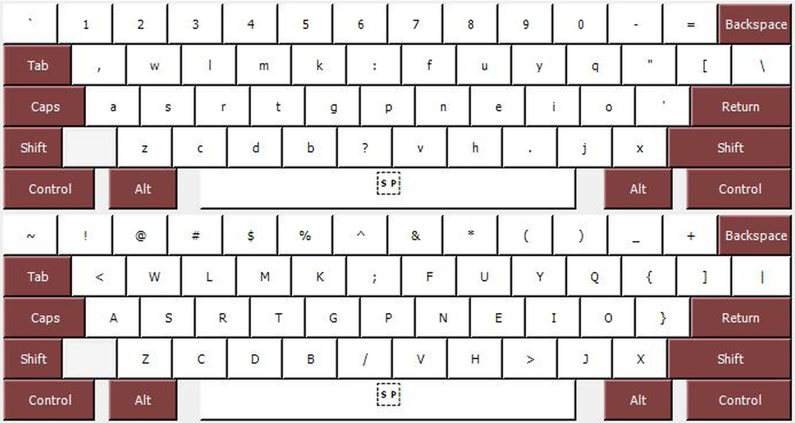

# ORNATE-Optimized-Keyboard-Layout-Project
An optimized keyboard layout for easier and faster typing.

# How to install

### in Linux:

---

see install instruction in [Linux](./Linux) directory

### in Windows:

----

1. Go to the green button "Code" and download the zipped package.

2. Unzip and go to `Windows` directory > `ORNATE` (or any of the variant layouts).
3. Just run setup.exe. 
     > for programming or just for reversing the numbers and symbols: download the ORNATE for programming folder (or ORNATE for programming WIDE mod) and run setup.exe. 

    > OR if you want to have the WIDE mod, with more even space between the hands and ease on the wrists and shoulders, ORNATE wide mod achieves this effect without sacrificing any of the efficiency.
4. Press Win + Spacebar to change the layout in Windows. 

* An image of the keyboard layout is in the `/img/` directory for touch typing reference. 

* Source code available in `/src/` directory. Use Microsoft Keyboard Layout Creator to view source in Windows.

## ORNATE Features

* 50-50 balanced workload between the left and right hand

* High typing efficiency

* Very low overall finger travel 

* Very low same finger bigrams allowing for faster typing

* Common English bigrams are easy to type

* Comfortable, ergonomic, and efficient — frequent keys are placed within the natural range of motion of the fingers

* in Windows: ZXCV shortcuts are masked in their old positions, meaning that pressing the Ctrl key will use ZXCV shortcuts in their old positions. This is for normal setup only. If you use the Autohotkey script, ZXCV will change according to the new positions.

## What's wrong with QWERTY and the standard layout? ##
The conventional QWERTY keyboard is not optimized for modern day typing because it was designed in 1873 to prevent typewriter keys from jamming, not for easier or faster typing. Under QWERTY the most frequently used keys were placed apart from each other to prevent them from jamming; this results in a non-ergonomic layout. The problem is, we don't use typewriters anymore so the question of keys jamming is reduntant. Keyboards are still using this inefficient layout. 

* It places very rare letters in the best positions, so your fingers have to move a lot more. 

* It suffers from a high same finger ratio that slows down typing and increases strain. 

* It allows for very long sequences of letters with the same hand (e.g. "sweaterdresses") 

* It suffers from an extremely high ratio of home-row-jumping sequences (e.g. "minimum")

* The most frequently typed keys are scattered around the edges of keyboard. Letters that are infrequently typed (e.g. J and K) are in prime positions! 

* The two most common consonants in English, T and N, require diagonal stretches from the keyboard's home position. 

* There are frequent, difficult combinations of letters such as DE and LO because these are typically typed with the same finger. For example, try typing 'Lollipop' with a QWERTY keyboard.

All these flaws make it harder and less comfortable to type than it could be, and make it more likely that keyboard users experience health problems such as RSI, or at least lead to inefficient and error-strewn typing. However, there are alternatives available.

## Solutions ##

There are both software and hardware solutions to all these problems available. There are alternative keyboard layouts and other neat tricks that deal with many of the problems, and entirely new hardware designs that address others. You can mix and match these as you please: some people stick with standard keyboard hardware but use an alternative layout configured in software; others continue to use Qwerty but choose an ergonomically designed keyboard, and yet others do both.

People who have switched will often rave about how much better their experience of typing has become. Some find there is an increase in typing speed, but more importantly, nearly all experience a huge gain in comfort. Only once you become adapted to typing using a well-designed, ergonomic layout, do you fully appreciate the benefits, and realise just how unsatisfactory Qwerty was all along. If you spend a large part of your day at a computer keyboard, there is potential for a huge quality of life improvement.

This is a variation of the Colemak-DH keyboard layout. It uses Colemak's own metrics to score a lower Finger Bigram frequency and lower Total Finger Effort score than Colemak itself. It is 84% more efficient than QWERTY.

## Resources for Touch Typing Training
* [Keybr](https://www.keybr.com/)
* [Monkeytype](https://monkeytype.com/)
* [Typeracer](https://play.typeracer.com/)

## Keyboard Layout Analyzer Scores (AKA How ORNATE is better)

| Overall Finger Distance Travel (using text of "1984" by George Orwell)| (in metres)  |
| --- | --- |
| ORNATE | 594.0 |
| Colemak | 653.0 |
| Workman | 610.6 |
| Dvorak | 659.6 |
| QWERTY | 1125.8 |

### Using [Colemak Mod-DH analyzer](https://colemakmods.github.io/mod-dh/analyze.html) ###

| Finger Frequency |   | 
| --- | --- |
| left pinky: 	9.62%  	 | right pinky: 	8.91% |
| left ring: 	8.33%  	   | right ring: 	8.81% |
| left middle: 	11.69%   | right middle: 	15.76% |
| left index: 	19.69%   | right index: 	17.19% |
| **total L 	49.33%** (vs QWERTY: 55.02%) 	   | **total R 	50.67%** (vs QWERTY: 44.98%) |

| Finger Bigram Frequency (lower is better) |   |
| --- | ---| 
| left pinky: 	0.022%	| right pinky: 	0.084% |
| left ring: 	0.079%	| right ring: 	0.045% |
| left middle: 	0.417%	| right middle: 	0.381% |
| left index: 	0.225%	| right index: 	0.162% |
| **ORNATE total:**  | 	**1.415%** |
| Other layouts: | |
| QWERTY: | 6.575%  |
| Dvorak: | 2.625% |
| Workman: | 3.147% |
| Colemak: | 1.669% |
| Colemak-DH: | 1.644%  |

| Finger Effort (lower is better) |   |   |   |   |
| --- | --- | --- | --- | ---|
| 	| base	| same finger bigrams | neighbour finger bigrams |	total |
| left pinky | 0.18444 |	0.00055 |	0.01784	| 0.20283 |
| left ring |	0.12866 |	0.00198 |	0.00101	| 0.13165 |
| left middle | 0.19038 |	0.01162	| 0.00000 |	0.20200 |
| left index | 0.34115 |	0.00658 |	0.00000	| 0.34773 |
| right index |	0.28565	| 0.00412 |	0.00000 |	0.28977 |
| right middle | 	0.20320 |	0.00967 |	0.00000 |	0.21287 |
| right ring |	0.13351	| 0.00113	| 0.00192 |	0.13656 |
| right pinky | 0.16990 |	0.00239 |	0.00997 |	0.18227 |
| **total** | 	**1.63689**	| **0.03803**	| **0.03075**	| **1.70566** |
| Other layouts: |||||
| QWERTY | 2.24566 |0.18467 |0.03006|2.46039|
| Dvorak | 1.85069 |0.06683|0.01323|1.93075|
| Workman | 1.68059 |0.08280|0.02812|1.79151|
| Colemak | 1.73279 |0.04722|0.02939|1.80939|
| Colemak-DH | 1.64170 |0.04330|0.02983|1.71482|

### Different layout scores using various texts from [stevep99 analyzer fork](https://stevep99.github.io/keyboard-layout-analyzer/#/main) (higher is better) ###

|  | ORNATE | Colemak-DH | Colemak | Workman | Dvorak | QWERTY |
| --- | --- | --- | --- | --- | --- | --- |
| Alice in Wonderland, Chapter 1 | *69.40* | 68.51 |	66.61 |	65.88 |	63.71 |	45.13 |
| Magna Carta	|*70.24*	| 70.08	| 68.09	| 66.53	| 65.08	| 43.39 |
| 1984, Chapter 1	| *69.78*	| 69.55	| 67.47	| 65.65	| 65.25	| 42.21 |
| Tarzan of the Apes	| 69.81	| *70.43*	| 68.38	| 67.54	| 65.43	| 43.29 |
| Lorem Ipsum	| *58.98*	| 58.47	| 57.06	| 53.71	| 51.61	| 34.03 |
| Tao te ching	| 63.03	| *63.12*	| 61.61	| 59.67	| 58.68	| 37.7 |
| Academic paper Cost optimization model	| 58.79	| *59.85*	| 58.11	| 54.99	| 50.78	| 32.76 |
| Academic paper Contractor performance in construction	| *59.55*	| 58.63	| 57.38	| 49.66	| 47.38	| 30.27 |
| Academic paper Binary logistic analysis	| 59.78	| *60.29*	| 59.05	| 55.75	| 54.23	| 30.98 |
| programming:  game of life	| 40.77	| *41.26*	| 38.86	| 39.01	| 35.35	| 26.54 |
| Average scores of the 10 tests | 62.01 | *62.02* | 60.26 | 57.84 | 55.75 | 36.63 |

Conclusion: As evidenced from all the scores and metrics, ORNATE is on par with the Colemak-DH layout and it outperforms every other layout.
